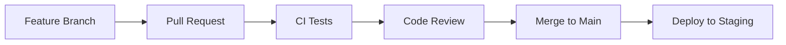
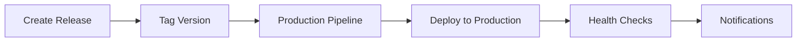

# 🚀 CI/CD Pipeline Setup Guide

This document provides comprehensive instructions for setting up and configuring the CI/CD pipeline for the Customer Segmentation project.

## 📋 Table of Contents

1. [Pipeline Overview](#pipeline-overview)
2. [Prerequisites](#prerequisites)
3. [GitHub Actions Setup](#github-actions-setup)
4. [Environment Configuration](#environment-configuration)
5. [Deployment Strategies](#deployment-strategies)
6. [Monitoring and Observability](#monitoring-and-observability)
7. [Troubleshooting](#troubleshooting)

## 🔄 Pipeline Overview

The CI/CD pipeline consists of multiple workflows:

### **Main Pipeline (`ci-cd.yml`)**
- **Triggers**: Push to `main`/`develop`, Pull Requests, Releases
- **Stages**: Test → Build → Deploy → Monitor
- **Features**: Multi-Python version testing, Docker builds, security scanning

### **Security Pipeline (`security-scan.yml`)**
- **Triggers**: Daily schedule, Push/PR events
- **Features**: Dependency scanning, Code analysis, Secret detection

### **Monitoring Pipeline (`model-monitoring.yml`)**
- **Triggers**: Weekly schedule, Manual dispatch
- **Features**: Model performance monitoring, Data quality checks, API health monitoring

## 📋 Prerequisites

### **1. Repository Setup**
```bash
# Ensure your repository has the following structure:
├── .github/workflows/
├── src/
├── tests/
├── Dockerfile
├── docker-compose.yml
├── k8s/
└── requirements.txt
```

### **2. GitHub Repository Settings**

#### **Enable GitHub Actions**
1. Go to **Settings** → **Actions** → **General**
2. Select **"Allow all actions and reusable workflows"**

#### **Configure Branch Protection**
```yaml
# Recommended branch protection rules for 'main'
- Require pull request reviews
- Dismiss stale reviews when new commits are pushed
- Require status checks to pass before merging
- Require branches to be up to date before merging
- Required status checks: "Test & Quality Check", "Build & Scan Docker Image"
```

## 🔧 GitHub Actions Setup

### **1. Repository Secrets Configuration**

Navigate to **Settings** → **Secrets and variables** → **Actions** and add:

#### **Container Registry Secrets**
```bash
# Automatically available - no setup needed
GITHUB_TOKEN  # Auto-generated by GitHub
```

#### **Deployment Secrets** (for staging/production)
```bash
# Staging Environment
STAGING_HOST          # e.g., staging-server.your-domain.com
STAGING_USER          # SSH username
STAGING_SSH_KEY       # Private SSH key content

# Production Environment  
PRODUCTION_HOST       # e.g., production-server.your-domain.com
PRODUCTION_USER       # SSH username
PRODUCTION_SSH_KEY    # Private SSH key content

# Optional: Notification integrations
SLACK_WEBHOOK         # Slack webhook URL for notifications
```

#### **Generate SSH Keys for Deployment**
```bash
# On your local machine
ssh-keygen -t ed25519 -C "github-actions-deploy" -f github-actions-key

# Add public key to server's authorized_keys
cat github-actions-key.pub >> ~/.ssh/authorized_keys

# Add private key content to GitHub secrets
cat github-actions-key  # Copy this to STAGING_SSH_KEY/PRODUCTION_SSH_KEY
```

### **2. Environment Configuration**

#### **Create GitHub Environments**
1. Go to **Settings** → **Environments**
2. Create environments: `staging`, `production`
3. Configure protection rules:
   - **Staging**: No restrictions
   - **Production**: Required reviewers, deployment branches

#### **Environment URLs**
- **Staging**: `https://staging.customer-segmentation.your-domain.com`
- **Production**: `https://customer-segmentation.your-domain.com`

## 🚀 Deployment Strategies

### **1. Development Workflow**


### **2. Production Deployment**


### **3. Docker Deployment Flow**

#### **Local Development**
```bash
# Test locally before pushing
./deploy.sh dev

# Run tests
./deploy.sh test
```

#### **Staging Deployment (Automatic)**
- Triggered on push to `main`
- Builds and pushes container to GitHub Container Registry
- Deploys to staging environment
- Runs integration tests

#### **Production Deployment (Manual)**
- Triggered on GitHub release creation
- Deploys tagged version to production
- Requires manual approval (configured in environment)
- Includes rollback capabilities

## 📊 Monitoring and Observability

### **1. Pipeline Monitoring**

#### **GitHub Actions Insights**
- Monitor workflow success/failure rates
- Track build times and resource usage
- Set up failure notifications

#### **Container Registry**
- Monitor image sizes and security vulnerabilities
- Clean up old images automatically
- Track image pull statistics

### **2. Application Monitoring**

#### **Health Checks**
```yaml
# Kubernetes health checks
livenessProbe:
  httpGet:
    path: /health
    port: 8080
  initialDelaySeconds: 60
  periodSeconds: 10

readinessProbe:
  httpGet:
    path: /health
    port: 8080
  initialDelaySeconds: 30
  periodSeconds: 5
```

#### **Performance Monitoring**
- API response time tracking
- Resource utilization monitoring
- Model performance metrics
- Data quality monitoring

### **3. Alerting Configuration**

#### **Slack Integration**
```yaml
# Add to workflow for notifications
- name: Notify Deployment
  uses: 8398a7/action-slack@v3
  with:
    status: ${{ job.status }}
    text: "Deployment ${{ job.status }}"
  env:
    SLACK_WEBHOOK_URL: ${{ secrets.SLACK_WEBHOOK }}
```

## 🔒 Security Configuration

### **1. Code Security**

#### **Static Analysis**
- **Bandit**: Python security linting
- **Safety**: Dependency vulnerability scanning  
- **Semgrep**: Code pattern security analysis
- **CodeQL**: GitHub's semantic code analysis

#### **Container Security**
- **Trivy**: Container image vulnerability scanning
- **Distroless base images**: Minimal attack surface
- **Non-root user**: Security hardening

#### **Secrets Management**
- Use GitHub Secrets for sensitive data
- Never commit credentials to repository
- Rotate keys regularly
- Use least-privilege access

### **2. Dependency Management**

#### **Automated Updates**
```yaml
# .github/dependabot.yml
version: 2
updates:
  - package-ecosystem: "pip"
    directory: "/"
    schedule:
      interval: "weekly"
    reviewers:
      - "your-username"
```

## 🐛 Troubleshooting

### **Common Issues and Solutions**

#### **1. Build Failures**

**Docker Build Issues:**
```bash
# Check Docker build locally
docker build -t test-image .

# Check build logs
docker build --progress=plain -t test-image .
```

**Python Dependency Issues:**
```bash
# Update requirements.txt
pip freeze > requirements.txt

# Test dependencies
pip install -r requirements.txt
```

#### **2. Test Failures**

**Unit Test Issues:**
```bash
# Run tests locally
python -m pytest tests/ -v

# Check test coverage
python -m pytest tests/ --cov=src --cov-report=html
```

**Integration Test Issues:**
```bash
# Test API locally
./deploy.sh dev
python examples/api_client_example.py
```

#### **3. Deployment Issues**

**SSH Connection Problems:**
```bash
# Test SSH connection
ssh -i github-actions-key user@server-ip

# Check server logs
sudo journalctl -u docker.service -f
```

**Container Issues:**
```bash
# Check container logs
docker logs customer-segmentation-api

# Check container health
docker inspect customer-segmentation-api
```

#### **4. Performance Issues**

**Slow Build Times:**
- Enable Docker build cache
- Use multi-stage builds
- Optimize dependency installation

**High Resource Usage:**
- Adjust container resource limits
- Optimize application code
- Scale horizontally with Kubernetes

## 📈 Advanced Configuration

### **1. Multi-Environment Setup**

#### **Environment-Specific Configurations**
```yaml
# .github/environments/
staging.yml:
  api_url: https://staging.api.com
  replica_count: 2
  resources:
    memory: "512Mi"
    cpu: "250m"

production.yml:
  api_url: https://api.com  
  replica_count: 5
  resources:
    memory: "1Gi"
    cpu: "500m"
```

### **2. Blue-Green Deployment**
```yaml
# Kubernetes blue-green deployment
apiVersion: argoproj.io/v1alpha1
kind: Rollout
metadata:
  name: customer-segmentation-rollout
spec:
  replicas: 5
  strategy:
    blueGreen:
      activeService: customer-segmentation-active
      previewService: customer-segmentation-preview
      autoPromotionEnabled: false
      scaleDownDelaySeconds: 30
  selector:
    matchLabels:
      app: customer-segmentation-api
```

### **3. Canary Deployment**
```yaml
# Istio canary deployment configuration
apiVersion: networking.istio.io/v1alpha3
kind: VirtualService
metadata:
  name: customer-segmentation-canary
spec:
  http:
  - match:
    - headers:
        canary:
          exact: "true"
    route:
    - destination:
        host: customer-segmentation-service
        subset: v2
  - route:
    - destination:
        host: customer-segmentation-service
        subset: v1
      weight: 90
    - destination:
        host: customer-segmentation-service
        subset: v2
      weight: 10
```

## 📚 Additional Resources

### **Documentation**
- [GitHub Actions Documentation](https://docs.github.com/actions)
- [Docker Best Practices](https://docs.docker.com/develop/dev-best-practices/)
- [Kubernetes Deployment Guide](https://kubernetes.io/docs/concepts/workloads/controllers/deployment/)

### **Monitoring Tools**
- [Prometheus + Grafana](https://prometheus.io/)
- [ELK Stack](https://www.elastic.co/elk-stack/)
- [New Relic](https://newrelic.com/)
- [DataDog](https://www.datadoghq.com/)

### **Security Tools**
- [Snyk](https://snyk.io/)
- [Aqua Security](https://www.aquasec.com/)
- [Twistlock/Prisma Cloud](https://www.paloaltonetworks.com/prisma/cloud)

---

**🎯 Quick Start Checklist**

- [ ] Repository secrets configured
- [ ] GitHub environments created
- [ ] SSH keys generated and deployed
- [ ] Branch protection rules enabled
- [ ] First pipeline run successful
- [ ] Staging environment accessible
- [ ] Production deployment tested
- [ ] Monitoring alerts configured
- [ ] Team notifications set up

**Need Help?** 
- Check the [troubleshooting section](#troubleshooting)
- Review GitHub Actions logs
- Test components locally first
- Reach out to the DevOps team for infrastructure issues
